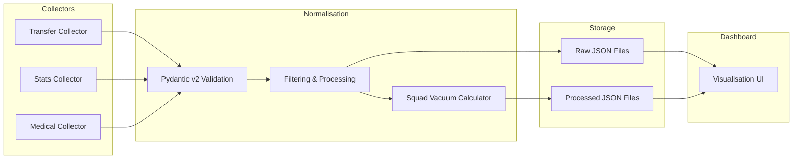

# Championship Squad Tracker

> A deterministic data pipeline and research dashboard for EFL Championship football analysis.

[](LICENSE)
[](https://www.python.org/downloads/)

---

## Mission

Championship Squad Tracker is a **data-first, deterministic aggregator** built for sports journalists, analysts, and researchers who need reliable, reproducible insights into EFL Championship squads during transfer windows.

It collects, normalises, and structures transfer activity, player performance metrics, medical records, and positional depth data — **without relying on AI predictions or probabilistic models**. Every output is traceable back to its source and fully reproducible.

---

## Architecture Overview



**Data Flow**: `Data Sources → Collectors → Pydantic Validation → Filtering/Processing → Structured JSON → Dashboard UI`

---

## Roadmap

### Section 1 — Foundation
- [x] Repository scaffolding and documentation
- [ ] Pydantic v2 data models (`Player`, `Transfer`, `PlayerStats`, `MedicalHistory`, `Club`)
- [ ] Abstract collector interfaces (`BaseCollector`, `BaseDataProvider`)
- [ ] Processing module (`filter_relevant_players`, `calculate_squad_vacuum`)
- [ ] Local JSON storage engine
- [ ] Unit test suite

### Section 2 — Data Collection
- [ ] Mock data provider with representative Championship datasets
- [ ] Live data provider adapters (web scraping / API integration)
- [ ] Pipeline orchestrator (`IngestionPipeline`)

### Section 3 — Analysis & Visualisation
- [ ] Squad depth analysis module
- [ ] Transfer window impact reports
- [ ] Interactive dashboard UI

### Section 4 — Production Hardening
- [ ] CI/CD pipeline
- [ ] Data validation and integrity checks
- [ ] Documentation site

---

## Local Setup

### Prerequisites

- Python 3.11+
- [uv](https://docs.astral.sh/uv/) (recommended) or pip

### Installation

```bash
# Clone the repository
git clone https://github.com/<your-org>/championship-squad-tracker.git
cd championship-squad-tracker

# Create and activate a virtual environment
python -m venv .venv
source .venv/bin/activate  # macOS/Linux
# .venv\Scripts\activate   # Windows

# Install dependencies
pip install -r requirements.txt

# Run the test suite
pytest --verbose
```

### Project Structure

```
Sports Club Assessor/
├── src/
│   ├── models/          # Pydantic v2 data schemas
│   ├── collectors/      # Modular data collection interfaces
│   ├── processing/      # Filtering, metrics, and analysis
│   ├── storage/         # Local JSON persistence
│   └── pipeline.py      # Ingestion orchestrator
├── tests/               # Unit and integration tests
├── data/                # Raw and processed data output (gitignored)
├── docs/                # Architecture and schema documentation
└── README.md
```

---

## Contributing

Please read [docs/ARCHITECTURE.md](docs/ARCHITECTURE.md) before contributing. All data collection and processing code **must** be strictly deterministic — no LLM or probabilistic logic in the pipeline.

---

## License

This project is licensed under the MIT License — see [LICENSE](LICENSE) for details.
