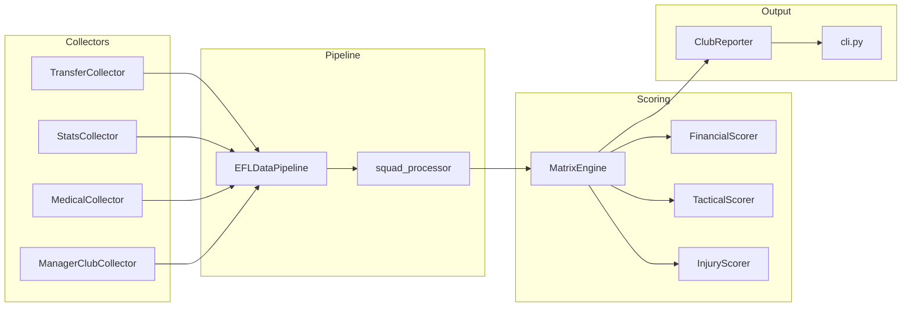

# Championship Squad Tracker

> A deterministic data pipeline and CLI for EFL Championship club and league analysis.

[](LICENSE)
[](https://www.python.org/downloads/)

---

## Mission

Championship Squad Tracker is a **data-first, deterministic aggregator** built for sports journalists, analysts, and researchers who need reliable, reproducible insights into EFL Championship squads.

It collects transfer activity, player performance stats, and medical records, validates them with Pydantic v2 schemas, scores each club across financial, tactical, and injury dimensions, and produces both single-club and league-wide reports — **without relying on AI predictions or probabilistic models**. Every output is traceable back to its source and fully reproducible from mock or live data.

---

## Architecture Overview



For league-scale runs, `LeaguePipeline` orchestrates `EFLDataPipeline` + `MatrixEngine` per club, backed by `CacheManager` — see [docs/LEAGUE_RUNNER.md](docs/LEAGUE_RUNNER.md) for details.

**Data flow**: `Collectors → EFLDataPipeline → Pydantic validation → MatrixEngine scoring → ClubReporter → Terminal / Markdown`

---

## Quickstart

### Prerequisites

- Python 3.11+
- pip

### Installation

```bash
# Clone the repository
git clone https://github.com/<your-org>/championship-squad-tracker.git
cd championship-squad-tracker

# Create and activate a virtual environment
python -m venv .venv
source .venv/bin/activate  # macOS/Linux
# .venv\Scripts\activate   # Windows

# Install dependencies
pip install -r requirements.txt
```

### Running Tests

All unit tests run against fixtures in `data/mock/` — no live network calls are made.

```bash
pytest --verbose
```

---

## Single Club Analysis

Run a full pipeline + scoring pass for one club using mock fixtures:

```bash
python -m src.cli analyze --club-id c_399 --mock
```

Export a Markdown report alongside the terminal summary:

```bash
python -m src.cli analyze --club-id c_399 --mock --output reports/c_399_report.md
```

Flags:

| Flag | Description |
|---|---|
| `--club-id` | Club identifier to analyze (required). Must match an entry in the mock/live club registry. |
| `--mock` / `--no-mock` | Use local fixtures (default) or live collectors. |
| `--output` | File or directory path to export a Markdown report to. |

---

## League Analysis

Run the full league across every club, using the cache to avoid redundant collection:

```bash
python -m src.cli analyze-league --league championship --season 2026-2027
```

Force a full re-collection, bypassing any cached club data:

```bash
python -m src.cli analyze-league --league championship --season 2026-2027 --force-refresh
```

See [docs/LEAGUE_RUNNER.md](docs/LEAGUE_RUNNER.md) for cache internals, TTL behavior, and report formats.

---

## Project Structure

```
Sports Club Assessor/
├── src/
│   ├── cache.py             # CacheManager: TTL-based file cache for league runs
│   ├── cli.py               # CLI entry point (analyze / analyze-league)
│   ├── pipeline.py          # EFLDataPipeline — single-club orchestration
│   ├── league_pipeline.py   # LeaguePipeline — league-wide orchestration + caching
│   ├── reporter.py          # ClubReporter — terminal + Markdown output
│   ├── schemas.py           # Pydantic v2 data models
│   ├── collectors/          # Transfer, stats, medical, and club collectors
│   ├── processors/          # Squad vacuum / filtering logic
│   └── scoring/             # MatrixEngine + Financial/Tactical/Injury scorers
├── tests/                   # Unit and integration tests (mock-backed)
├── data/
│   ├── mock/                 # Fixture data used by tests and --mock runs
│   └── cache/                 # CacheManager output (gitignored)
├── docs/
│   ├── CODEBASE_MAP.md       # AST index of src/ — consult before searching code
│   └── LEAGUE_RUNNER.md      # League-scale operations guide
└── README.md
```

---

## Contributing

Consult [docs/CODEBASE_MAP.md](docs/CODEBASE_MAP.md) before searching the codebase. All data collection and processing code **must** be strictly deterministic — no LLM or probabilistic logic in the pipeline.

---

## License

This project is licensed under the MIT License — see [LICENSE](LICENSE) for details.
