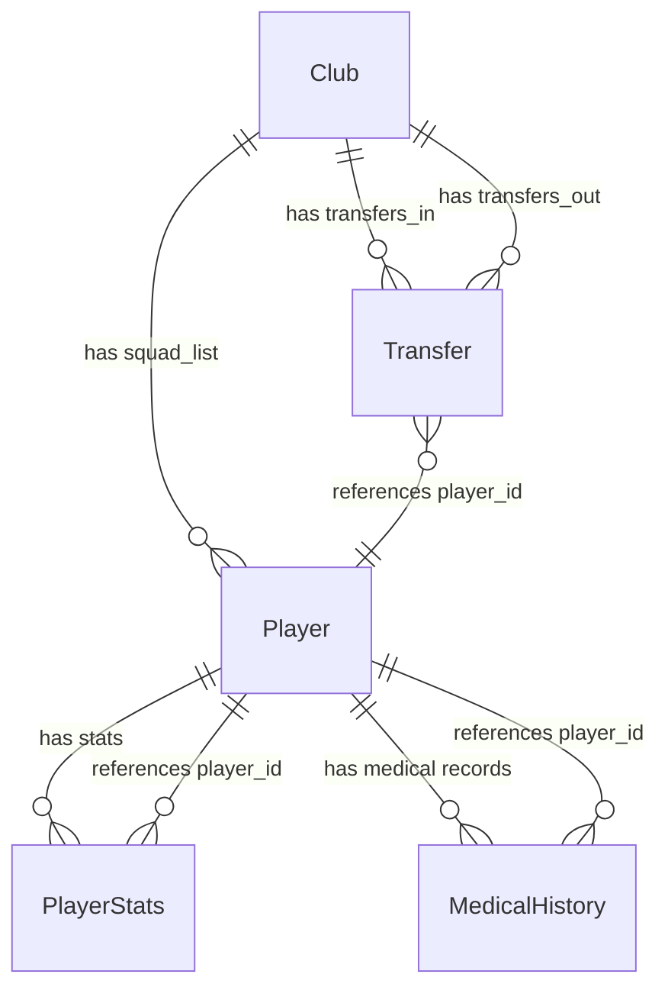

# Data Schema Specification

> Draft specification for all data entities in the Championship Squad Tracker pipeline.

**Status**: 📝 Draft — will be finalised when Pydantic models are implemented in `src/models/`.

---

## Overview

All entities are defined as **Pydantic v2 BaseModel** subclasses with strict field validation. The schema layer is the single source of truth for data structure across the entire pipeline.

### Entity Relationship Diagram



---

## Entities

### 1. Player

Represents an individual footballer in a Championship squad.

| Field | Type | Constraints | Description |
|---|---|---|---|
| `id` | `str` | Required, non-empty | Unique player identifier |
| `name` | `str` | Required, non-empty | Full display name |
| `age` | `int` | Required, > 0 | Current age in years |
| `primary_position` | `str` | Required | Primary playing position (e.g. `"CM"`, `"ST"`, `"GK"`) |
| `market_value` | `float` | Required, >= 0.0 | Estimated market value in GBP |
| `nationality` | `str` | Required, non-empty | Player nationality |

---

### 2. Transfer

Represents a single transfer transaction (incoming or outgoing) during a window.

| Field | Type | Constraints | Description |
|---|---|---|---|
| `player_id` | `str` | Required, non-empty | References `Player.id` |
| `direction` | `TransferDirection` | Required, Enum: `IN`, `OUT` | Whether the player joined or left |
| `fee` | `float \| None` | Optional, >= 0.0 if present | Transfer fee in GBP. `None` for free/undisclosed. |
| `previous_club` | `str` | Required | Club the player came from |
| `current_club` | `str` | Required | Club the player moved to |
| `transfer_type` | `TransferType` | Required, Enum: `PERMANENT`, `LOAN`, `FREE`, `UNDISCLOSED` | Nature of the transfer |

**Enums**:
- `TransferDirection`: `IN` | `OUT`
- `TransferType`: `PERMANENT` | `LOAN` | `FREE` | `UNDISCLOSED`

---

### 3. PlayerStats

Season-level performance statistics for a player.

| Field | Type | Constraints | Description |
|---|---|---|---|
| `player_id` | `str` | Required | References `Player.id` |
| `season` | `str` | Required, format `"YYYY/YYYY"` | Season identifier (e.g. `"2024/2025"`) |
| `minutes_played` | `int` | Required, >= 0 | Total minutes on the pitch |
| `goals` | `int` | Required, >= 0 | Goals scored |
| `assists` | `int` | Required, >= 0 | Assists provided |
| `rating` | `float` | Required, 0.0–10.0 | Average match rating |
| `matches_started` | `int` | Required, >= 0 | Number of matches started |

---

### 4. MedicalHistory

Individual injury record for a player within a season.

| Field | Type | Constraints | Description |
|---|---|---|---|
| `player_id` | `str` | Required | References `Player.id` |
| `injury_type` | `str` | Required | Description of injury (e.g. `"ACL Tear"`, `"Hamstring Strain"`) |
| `days_out` | `int` | Required, >= 0 | Calendar days absent |
| `games_missed` | `int` | Required, >= 0 | Competitive matches missed |
| `season` | `str` | Required | Season in which injury occurred |

---

### 5. Club

Aggregate entity representing a Championship club and its squad composition.

| Field | Type | Constraints | Description |
|---|---|---|---|
| `id` | `str` | Required, non-empty | Unique club identifier |
| `name` | `str` | Required | Official club name |
| `manager` | `str` | Required | Current head coach / manager |
| `squad_list` | `List[Player]` | Required | Current squad roster |
| `transfers_in` | `List[Transfer]` | Required | Incoming transfers this window |
| `transfers_out` | `List[Transfer]` | Required | Outgoing transfers this window |

---

### 6. SquadVacuumResult (Derived)

Computed output from `calculate_squad_vacuum()`. Not a stored entity — produced on demand.

| Field | Type | Constraints | Description |
|---|---|---|---|
| `total_lost_minutes` | `int` | >= 0 | Sum of minutes from departed players |
| `total_lost_goals` | `int` | >= 0 | Sum of goals from departed players |
| `total_lost_assists` | `int` | >= 0 | Sum of assists from departed players |
| `departed_players_count` | `int` | >= 0 | Number of players who left the club |

---

## JSON Serialisation

All entities are serialised using Pydantic v2's `model_dump_json(indent=2)` method. Enum fields are serialised as their string values (e.g. `"IN"`, `"PERMANENT"`).

### Example: Player JSON

```json
{
  "id": "p_001",
  "name": "Carlton Morris",
  "age": 28,
  "primary_position": "ST",
  "market_value": 5000000.0,
  "nationality": "English"
}
```

### Example: Transfer JSON

```json
{
  "player_id": "p_001",
  "direction": "OUT",
  "fee": 8000000.0,
  "previous_club": "Luton Town",
  "current_club": "Southampton",
  "transfer_type": "PERMANENT"
}
```

---

## Changelog

| Date | Change | Author |
|---|---|---|
| 2026-07-29 | Initial draft created | — |
